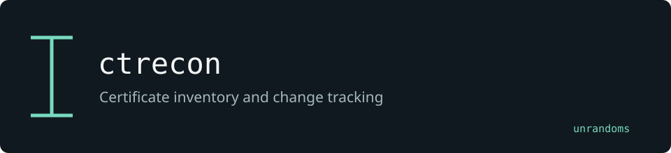

# ctrecon

Collects names from Certificate Transparency sources. Recursive discovery, optional DNS enrichment and a SQLite history extend the original command.

Maintained by [unrandoms](https://github.com/unrandoms), derived from [az7rb/crt.sh](https://github.com/az7rb/crt.sh).

## Fork-specific work

- [`recursive.go`](recursive.go)
- [`enrich.go`](enrich.go)
- [`delta.go`](delta.go)

## Validation and limits

A name missing from one collection is not proof that an asset has been removed. Sources may be unavailable or incomplete.

This documentation update does not certify all inherited features. The [archived reference](UPSTREAM_README.md) describes the original ecosystem; its package names and release links may target upstream rather than this fork.

## Credits

See [CREDITS.md](CREDITS.md) for the distinction between the original implementation and this fork's adaptations. Original licenses and copyright notices remain in the repository.
